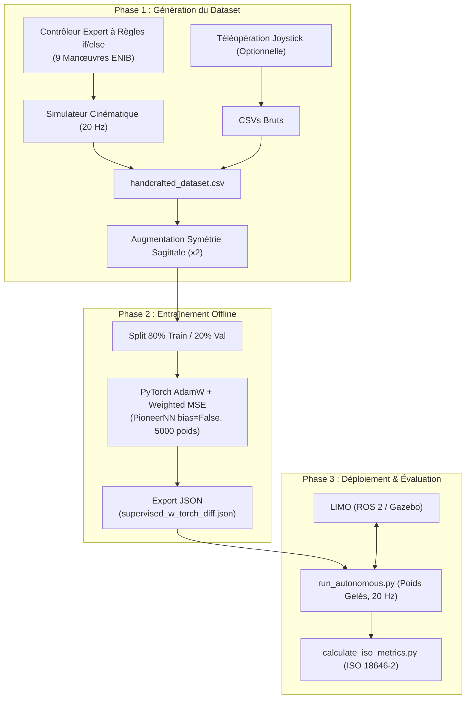

# Planification Expérimentale : Apprentissage Hors Ligne pour Robot Mobile AgileX LIMO

## 1. Synthèse de l'Analyse et Cadrage Théorique

### 1.1. Bilan des Travaux Précédents (Rapport de Stage M2)
Le projet précédent a établi les fondements de la commande neuronale en boucle fermée sur le robot mobile **AgileX LIMO** sous **ROS 2** :
- **Architecture Logicielle** : Isolation stricte entre le noyau d'apprentissage (`torch_back.py`, `torch_online.py`, `monitoring.py`) et la couche d'interface matérielle (`ros2_limo_interface.py`).
- **Cinématique Différentielle** : Commande en vitesses cartésiennes $[v_{\text{lin}}, v_{\text{ang}}]^T$.
- **Critère de Coût et Orientation Stratégique** :
  $$J = \alpha_x^2 (x - x_d)^2 + \alpha_y^2 (y - y_d)^2 + \alpha_\theta^2 (\theta - \theta_d - \theta_s(x,y))^2$$
  avec $\boldsymbol{\alpha} = [1/3, 1/3, 1/\pi]$ et $\theta_s(x,y) = \tanh(10x)\arctan(1y)$.
- **Limites Identifiées de l'Apprentissage en Ligne** : 
  1. *Forte sensibilité au taux d'apprentissage* : un pas d'apprentissage inadapté ($\eta \ge 0.50$) conduit à des divergences rapides et des secousses mécaniques dangereuses pour les réducteurs du robot réel.
  2. *Dérive odométrique cumulative* : glissement des roues (*wheel slip*) sans recalage par vérité terrain.
  3. *Chien de garde matériel (500 ms)* : le robot coupe les moteurs s'il ne reçoit pas de consigne `/cmd_vel` dans cet intervalle.

---

### 1.2. Les 9 Manœuvres Canoniques de l'ENIB (Cours Prof. Patrick Hénaff)
L'espace cinématique d'un robot différentiel dans le plan est discrétisé en 9 classes de comportements fondamentaux :
1. **Classe 1 (Avance)** : Translation avant rectiligne ($v > 0, \omega = 0$).
2. **Classe 2 (Avance à gauche)** : Virage avant vers la gauche ($v > 0, \omega > 0$).
3. **Classe 3 (Recule à droite)** : Virage arrière vers la droite ($v < 0, \omega < 0$).
4. **Classe 4 (Recule)** : Translation arrière rectiligne ($v < 0, \omega = 0$).
5. **Classe 5 (Recule à gauche)** : Virage arrière vers la gauche ($v < 0, \omega > 0$).
6. **Classe 6 (Avance à droite)** : Virage avant vers la droite ($v > 0, \omega < 0$).
7. **Classe 7 (Pivote à gauche)** : Rotation pure anti-horaire sur place ($v = 0, \omega > 0$).
8. **Classe 8 (Pivote à droite)** : Rotation pure horaire sur place ($v = 0, \omega < 0$).
9. **Classe 9 (Stop / Accostage)** : Arrêt stable à la cible ($v = 0, \omega = 0$).

---

### 1.3. La Norme Métrologique ISO 18646-2
La qualification des performances métrologiques en boucle fermée repose sur quatre caractéristiques normalisées :
- **Précision de Position ($A_p$)** : Distance euclidienne entre la consigne cible $(x_c, y_c)$ et le barycentre des poses atteintes $(\bar{x}, \bar{y})$.
- **Précision d'Orientation ($A_o$)** : Valeur absolue de l'erreur angulaire moyenne après recentrage dans $(-\pi, \pi]$.
- **Répétabilité de Position ($R_p$)** : Rayon de dispersion $\bar{l} + 3S_l$.
- **Répétabilité d'Orientation ($R_o$)** : Étalement angulaire sur trois écarts-types $3S_o$.

---

## 2. Architecture de l'Apprentissage Hors Ligne (Behavioral Cloning)

### 2.1. Modalités de Génération du Jeu de Données
Le projet supporte deux modalités de génération de données étiquetées :

1. **Modalité Principale : Contrôleur Expert à Règles (`src/data/generate_rule_based_dataset.py`)**
   - Implémente une politique experte déterministe via des instructions conditionnelles (`if / elif / else`).
   - Couvre de manière systématique les **9 manœuvres canoniques de l'ENIB** sur une grille de configurations multi-quadrants ($[-2.5\text{ m}, +2.5\text{ m}]$).
   - Intègre la cinématique différentielle à 20 Hz ($T_s = 50\text{ ms}$).
   - Fournit des démonstrations d'une pureté mathématique totale (aucun tremblement humain ou temps de réaction parasitaire).
   
2. **Modalité Secondaire : Téléopération Manuelle (`src/teleop/collect_demonstrations.py`)**
   - Capture en temps réel du pilotage opérateur (manette ou clavier) sur le robot réel ou sous Gazebo.
   - Filtrage des phases stationnaires et validation des schémas via `src/data/curate_dataset.py`.

3. **Augmentation par Symétrie Sagittale Bilatérale**
   - Exploitation de l'invariance géométrique du châssis :
     $$(x, y, \theta, v_{\text{lin}}, v_{\text{ang}}) \implies (x, -y, -\theta, v_{\text{lin}}, -v_{\text{ang}})$$
   - Double instantanément la taille de la base ($2\times$) et élimine tout biais directionnel gauche/droite.

---

### 2.2. Choix d'Architecture Réseau : Suppression des Biais (`bias=False`)

Le perceptron `PioneerNN` (3 entrées, 1000 neurones cachés, 2 sorties) est configuré avec **`bias=False`** :

$$\mathbf{h} = \tanh(W_1 \mathbf{x}), \quad \mathbf{y} = \tanh(W_2 \mathbf{h})$$

**Justifications fondamentales :**
1. **Condition d'Équilibre au Repos ($f(0, 0, 0) = [0.0, 0.0]$)** :
   Lorsque le robot atteint la cible avec une erreur nulle, $\tanh(0) = 0$ garantit que les consignes de vitesse deviennent strictement nulles. La présence de biais non nuls provoquerait un phénomène de dérive résiduelle (*hunting/chattering*) à l'accostage.
2. **Préservation de la Symétrie Sagittale** :
   La fonction $\tanh$ est impaire ($\tanh(-z) = -\tanh(z)$). L'absence de biais assure que les commandes de rotation pour des erreurs opposées sont rigoureusement antisymétriques.
3. **Fidélité Absolue du Modèle (5 000 Poids)** :
   Le modèle ne comporte que $3 \times 1000 + 1000 \times 2 = 5\,000$ paramètres, qui sont intégralement sauvegardés dans le fichier JSON standard (`input_weights`, `output_weights`). Zéro perte d'information entre l'entraînement et l'inférence.

---

### 2.3. Fonction de Perte Pondérée (MSE)
L'optimisation hors ligne minimise la perte quadratique moyenne pondérée :
$$\mathcal{L} = \frac{1}{N} \sum_{i=1}^N \Big( (v_{\text{lin}, i} - v_{\text{lin}, i}^*)^2 + \beta \cdot (v_{\text{ang}, i} - v_{\text{ang}, i}^*)^2 \Big)$$
avec $\beta = 1.0$ par défaut (ajustable en ligne de commande pour privilégier l'alignement angulaire si nécessaire).

---

## 3. Matrice Expérimentale et Protocole d'Évaluation

- **Cible de Référence** : $(0.0\text{ m}, 0.0\text{ m}, 0.0\text{ rad})$.
- **Configurations Initiales Multi-Quadrants ($n \ge 10$ essais par quadrant)** :
  - Quadrant 1 ($+x, +y$) : $(+2.5, +2.5, 0.0)$
  - Quadrant 2 ($-x, +y$) : $(-2.5, +2.5, -\pi/2)$
  - Quadrant 3 ($-x, -y$) : $(-2.5, -2.5, \pi)$
  - Quadrant 4 ($+x, -y$) : $(+2.5, -2.5, \pi/2)$
- **Critères Métrologiques Cibles (Norme ISO 18646-2)** :
  - Précision de position : $A_p \le 0.10\text{ m}$
  - Précision d'orientation : $A_o \le 0.15\text{ rad}$
  - Répétabilité de position : $R_p \le 0.25\text{ m}$
  - Répétabilité d'orientation : $R_o \le 0.30\text{ rad}$
